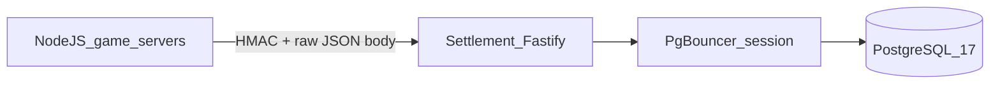

# Yeet Settlement Engine — Full Implementation Plan

Production-grade **game settlement backend** (not a casino engine). Game providers send signed **BET / WIN / ROLLBACK** events; this service applies them atomically, maintains an append-only ledger, and serves RTP reports.

**Priorities:** Correctness → Auditability → Scalability → Performance (never trade correctness for speed).

**Official spec:** `Yeet Public Backend Take-Home Challenge.txt`

**Documentation for implementers:**

| Doc | Purpose |
|-----|---------|
| [IMPLEMENTATION.md](IMPLEMENTATION.md) | Step-by-step full build + test checklist (executor guide) |
| [docs/CLAUDE_PROJECT_CONTEXT.md](docs/CLAUDE_PROJECT_CONTEXT.md) | **Full merged context for Claude Project / interviews** |
| [docs/CLAUDE_PROJECT_SETUP.md](docs/CLAUDE_PROJECT_SETUP.md) | How to upload files + voice interview instructions |
| [docs/TRADE_OFFS.md](docs/TRADE_OFFS.md) | All trade-off decisions |
| [docs/MECHANISMS.md](docs/MECHANISMS.md) | How it works + difficult cases |

---

## What this service is

| In scope | Out of scope |
|----------|----------------|
| HMAC-authenticated `process` API | Player signup UI, JWT on `process` |
| **`wallets.balance`** (single source of truth for play money) | Duplicate balance in API/game DB |
| Atomic balance + append-only ledger | On-chain bet signing per round |
| Idempotency, pre-rollback, code 100 | CQRS, Kafka, Redis balance cache |



---

## Wallets vs users vs API `user_id`

| Concept | Where it lives | Format |
|---------|----------------|--------|
| **Player account** (optional) | Platform API / auth | `player_id` UUID v7/ULID — product identity |
| **Wallet** (settlement) | `wallets` table | One row per **`(provider_user_id, currency)`** |
| **API field `user_id`** | Request body (take-home name) | Maps to `wallets.provider_user_id` |

- **`users` table is renamed `wallets`** — it was never a human user table.
- **All games** sharing the same `user_id` + `currency` hit the **same balance** (`game` is attribution only).
- **Playable balance exists only in settlement** — platform/games must not store an authoritative copy.

### Production-grade IDs

| Use | Format | Example |
|-----|--------|---------|
| Yeet games / simulators / k6 | **ULID** or **UUID v7** as `user_id` in body | `01J8XK9Q2MZ3YVW8N6P4R2T1K` |
| Currency | ISO-4217 or asset code column | `USD`, `USDT` |
| Acceptance tests A–K | **Opaque string from spec** (fixture only) | `8\|USDT\|USD` |

The take-home defines `"user_id": "string"` — it does **not** require pipe-delimited IDs. `"8|USDT|USD"` is only for **acceptance + HMAC examples**.

**Do not** parse pipes in core logic. Store `provider_user_id` as opaque text.

### Wallet creation (when rows appear)

| Entry point | Must create/fund wallet? | How |
|-------------|---------------------------|-----|
| **`process` endpoint** | Resolve every request | `upsertWallet()` at txn start (`INSERT … ON CONFLICT DO NOTHING` + `SELECT`) |
| **`tools/seed.ts`** | Yes | Insert acceptance wallet + bulk sim wallets with starting balance |
| **`tools/event-simulator.ts`** | Yes | Call shared `ensureWallets()` before traffic (seed or `POST` internal credit / direct DB seed in tool) |
| **`tools/rtp-game-runner.ts`** | Yes | Same — all simulated players funded before rounds |
| **`k6/process-load.js`** | Yes | `setup()` seeds wallets via HTTP helper or SQL; never bet on unknown unfunded ids |
| **Acceptance tests** | Yes | Rely on `pnpm db:seed` + lazy upsert on process |
| **Deposit (future)** | Yes | Single settlement txn: create wallet + credit + ledger `DEPOSIT` |

**Rule for simulators/load tests:** never assume a wallet exists with funds unless this tool or seed created it. Avoid code 100 noise from missing rows.

**Production path:** deposit credits settlement first; games only call `process`.

---

## Balance source of truth

- **Writes:** settlement only (`process`, future deposit/withdraw).
- **Platform API:** may store profile (`player_id`, email) — **not** playable balance.
- **Games:** receive `player_id` + `currency` in session; pass as `user_id` + `currency` in HMAC body.

---

## 2026 toolchain standards

| Area | Choice |
|------|--------|
| Runtime | **Node.js 22 LTS** |
| Language | **TypeScript 6.x** (`typescript@6`, `strict: true`, `target` ES2022+) |
| Package manager | **pnpm 9+** (`packageManager` in `package.json`, `corepack enable`) |
| API | **Fastify 5** |
| DB | **PostgreSQL 17** |
| Pool | **PgBouncer** (`pool_mode = session`) |
| ORM | **Drizzle ORM** + `drizzle-kit` |
| Validation | **Zod 3** |
| Tests | **Vitest 3**, **fast-check**, **k6** |
| Logging / traces | **Pino**, **OpenTelemetry** |
| Lint | **ESLint 9** flat + **Prettier** |
| CI | **GitHub Actions** + Docker Compose |

### Scripts

```json
{
  "db:seed": "tsx tools/seed.ts",
  "simulate:events": "tsx tools/event-simulator.ts",
  "simulate:rtp": "tsx tools/rtp-game-runner.ts",
  "load:k6": "k6 run k6/process-load.js",
  "test:unit": "vitest run tests/unit",
  "test:integration": "vitest run tests/integration",
  "test:acceptance": "vitest run tests/acceptance"
}
```

---

## Architecture

### Hot path (synchronous)

1. Verify **HMAC-SHA256** on **raw body** → `403`
2. **Zod** validate
3. **`BEGIN`**
4. **`resolveWallet(provider_user_id, currency)`** — upsert wallet row
5. For each action in order: idempotency → rollback rules → **`UPDATE wallets`** → ledger → `rtp_hourly`
6. **`COMMIT`** → `{ balance, transactions[], game_id? }`

### Cold path

- `ledger-integrity-worker` — hash chain, alert only
- `sliding-reconciliation-worker` — replay vs `wallets.balance`, alert only

### Multi-currency

- One wallet per **`(provider_user_id, currency)`** — no FX on bet path
- RTP per currency; never add USD + USDT for one RTP number

---

## API surface

| Method | Path | Purpose |
|--------|------|---------|
| `POST` | `/aggregator/takehome/process` | Balance or `actions[]` (body field remains `user_id` per spec) |
| `GET` | `/aggregator/takehome/rtp/users` | Per-wallet RTP |
| `GET` | `/aggregator/takehome/rtp/casino` | Casino-wide RTP |
| `GET` | `/health` | Readiness |

---

## Database model

### `wallets` (was `users`)

| Column | Type | Notes |
|--------|------|-------|
| `id` | BIGSERIAL PK | Internal `wallet_id` for FKs |
| `provider_user_id` | VARCHAR NOT NULL | API `user_id` (opaque) |
| `currency` | VARCHAR NOT NULL | `USD`, `USDT`, … |
| `balance` | BIGINT NOT NULL | Smallest unit |
| `created_at` / `updated_at` | TIMESTAMPTZ | |

**UNIQUE** `(provider_user_id, currency)`

### `action_lookup`

- `action_id` UUID PK
- `wallet_id` FK (not `user_id`)
- `ledger_id`, `tx_id`, `action_type`, `status`, `payload_hash`, `partition_hint`, `created_at`

### `ledger_actions` (monthly partitions)

- `wallet_id` FK, `tx_id`, `action_id`, `game`, `game_id`
- `action_type`, `amount`, `balance_before`, `balance_after`, `status`
- `original_action_id`, `previous_hash`, `current_hash`, `created_at`

### `rollback_intents`

- `original_action_id` PK, `rollback_action_id`, `wallet_id`, `created_at`

### `rtp_hourly`

- PK `(hour_bucket, wallet_id, currency)` — expose `provider_user_id` in reports via join

### `balance_snapshots` / `reconciliation_jobs`

- Reconciliation workers; `wallet_id` references

---

## Shared tooling: `tools/wallet-factory.ts`

Used by seed, event-simulator, rtp-game-runner, and k6 setup:

```typescript
// Production-style id
export function createPlayerId(): string {
  return ulid(); // or uuidv7()
}

// Ensure wallet exists with balance (for sims)
export async function ensureWallet(
  providerUserId: string,
  currency: string,
  initialBalance: bigint,
): Promise<void> { /* INSERT ON CONFLICT + set balance if seeding */ }
```

- **Acceptance:** `ensureWallet("8|USDT|USD", "USD", 74322001n)`
- **Load sim:** `ensureWallet(ulid(), "USD", randomBalance)`

---

## Event simulation and load testing

### `tools/seed.ts`

- Acceptance wallet: `8|USDT|USD` / `USD` / `74322001`
- N wallets: `provider_user_id = ulid()`, random balance for k6/simulators

### `tools/event-simulator.ts`

1. `ensureWallets()` for all synthetic players (funded)
2. HMAC `process` traffic (bet/win/rollback, duplicates, pre-rollback)

### `tools/rtp-game-runner.ts`

1. Create + fund wallets for all simulated `player_id`s
2. Run rounds; verify RTP endpoint

### `k6/process-load.js`

- `setup()`: seed or call ensure endpoint for VU player ids
- Never start load without funded wallets

---

## Testing strategy

**DB isolation:** `yeet_test` for vitest; `yeet_load` for k6; never pollute `yeet_dev`. Truncate between integration tests.

| Tier | Covers |
|------|--------|
| Unit | HMAC (spec hex), payload hash — no DB |
| Integration | ~10 cases: bet, batch, code 100, atomicity, idempotency, rollback, pre-rollback |
| Acceptance | HTTP **A–J** (K not in spec §4); re-seed per scenario file |
| Property | Phase 2: fast-check replay == `wallets.balance` |
| k6 | After acceptance; `ensureWallet` in setup |

See [IMPLEMENTATION.md](IMPLEMENTATION.md) for exact test list.

---

## Build order

1. Scaffold + Docker + pnpm (`typescript@6`, `engines.node >= 22`)
2. Schema: **`wallets`** + migrations + **`tools/seed.ts`** + **`tools/wallet-factory.ts`**
3. HMAC + Zod
4. Processor: `resolveWallet` + txn loop
5. Rollbacks, idempotency, RTP
6. Tests per layer → acceptance A–K
7. Simulators + k6 (all call `ensureWallet` / seed first)
8. Workers, properties, OTel, ADRs (`adr/00-` … `adr/06-`)

---

## ADRs

Two-digit prefix + topic slug only (no `0001` style). Files live under `adr/`.

| File | Topic |
|------|--------|
| `adr/00-ledger-vs-event-sourcing.md` | Ledger vs event sourcing |
| `adr/01-postgres-write-db.md` | Postgres as write DB |
| `adr/02-balance-projection.md` | `wallets.balance` projection |
| `adr/03-partition-strategy.md` | Monthly `ledger_actions` partitions |
| `adr/04-multi-currency-wallets.md` | One wallet per currency, no FX |
| `adr/05-wallet-lifecycle.md` | Wallet creation, balance SOtR, deposit-first |
| `adr/06-hmac-provider-auth.md` | HMAC on raw body vs JWT for `process` |

---

## Phase 1 exit criteria

- [ ] Table named **`wallets`**; FKs use `wallet_id`
- [ ] Seed + simulators + k6 **create and fund** wallets before play
- [ ] Product sims use **ULID/UUID** `user_id`; acceptance uses **`8|USDT|USD`**
- [ ] Acceptance A–K green; Docker up; README documents identity model

---

## Explicit non-goals

- Authoritative balance outside settlement
- JWT on `process`
- Per-game separate balances (same `user_id` + `currency` = shared wallet)

**Future deposit:** credits `wallets` in settlement only — platform calls settlement, does not sync two balances.
