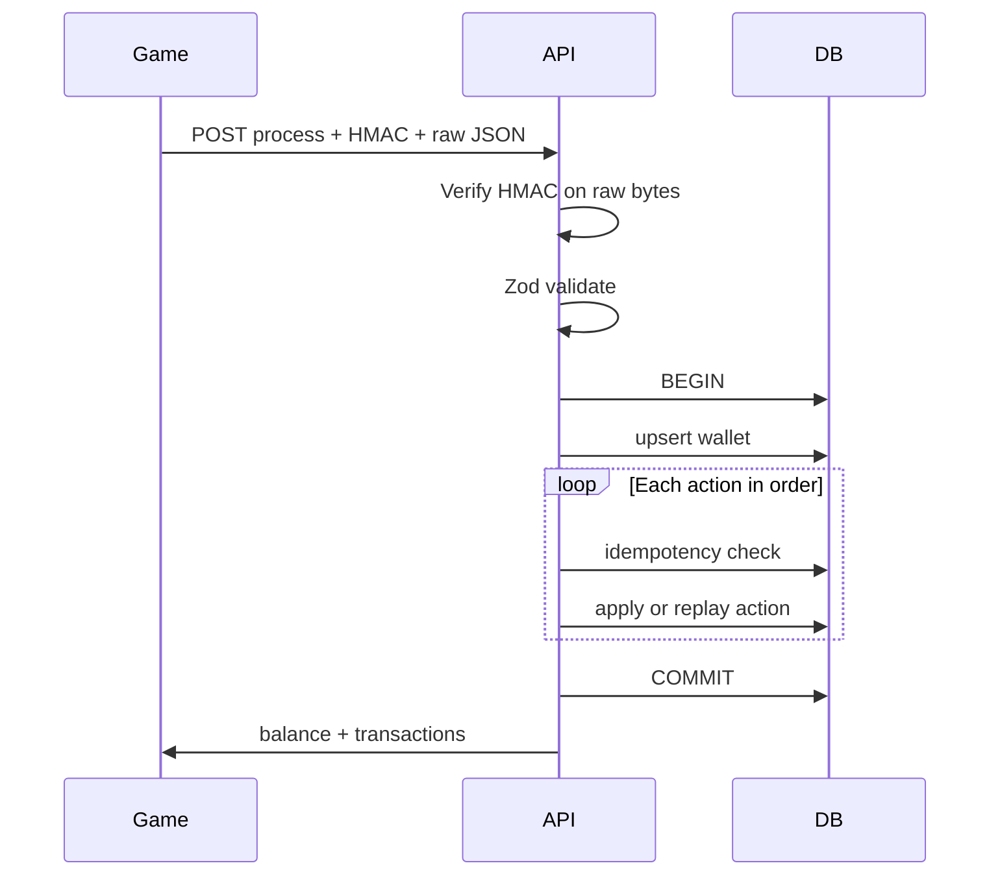

# Mechanisms and difficult cases — Yeet settlement engine

How the system works end-to-end and how edge cases are handled. Read this before implementing `src/services/transaction-processor.ts`.

---

## 1. Request lifecycle



**Failure anywhere in loop or wallet setup → ROLLBACK → no partial effects.**

---

## 2. HMAC mechanism

**Input:** exact HTTP body bytes as received.

**Steps:**

1. Read header `Authorization: HMAC-SHA256 <hex>`.
2. Reject if missing, wrong format, or odd-length hex.
3. `expected = HMAC_SHA256(secret, rawBody)`.
4. Compare with `timingSafeEqual(Buffer.from(hex,'hex'), expected)`.

**Tricky cases:**

| Case | Handling |
|------|----------|
| Re-parse JSON then re-stringify for verify | **Wrong** — breaks spacing/key order; use raw buffer from Fastify |
| Two spec examples with different JSON spacing | Both must verify if you test both vectors |
| Wrong secret | 403 |
| Tampered byte in body | 403 |

---

## 3. Wallet resolution

Every `process` call:

```sql
INSERT INTO wallets (provider_user_id, currency, balance)
VALUES ($1, $2, 0)
ON CONFLICT (provider_user_id, currency) DO NOTHING;

SELECT * FROM wallets WHERE provider_user_id = $1 AND currency = $2 FOR UPDATE;
```

`FOR UPDATE` locks the wallet row for the transaction duration.

**Difficult cases:**

| Case | Handling |
|------|----------|
| First request ever | Row created at 0; bet may fail code 100 until funded/seeded |
| Acceptance tests | Seed `8|USDT|USD` + USD @ 74322001 before tests |
| `currency` mismatch with stored row | Impossible if PK is pair; reject if you add consistency rules |
| Same person, two currencies | Two wallet rows, independent balances |

---

## 4. Idempotency mechanism

**Per `action_id` (global, not per wallet only):**

1. Compute `payload_hash = SHA256(canonical_json(action))` — stable key order, no whitespace variance in canonical form.
2. `SELECT` from `action_lookup` WHERE `action_id = $id`.
3. If found:
   - hash mismatch → **409**
   - hash match → append `{ action_id, tx_id: stored }` to response; **skip** balance, ledger mutation (except already applied), RTP increment.
4. If not found → process action → `INSERT action_lookup` with new `tx_id`.

**Cached result:** original `tx_id` (spec). **Not cached:** current `balance` (computed after whole batch).

**Difficult cases:**

| Case | Handling |
|------|----------|
| Duplicate in same HTTP batch (H) | First slot applies; second slot replays same `tx_id` |
| Retry same request from network | Same as duplicate action_ids |
| Two parallel requests same `action_id` | One wins INSERT; other gets conflict → SELECT → replay |
| Same `action_id`, different `amount` | 409 |

---

## 5. BET / WIN mechanics

**BET:**

```sql
UPDATE wallets SET balance = balance - $amount, updated_at = now()
WHERE id = $walletId AND balance >= $amount
RETURNING balance;
```

- 0 rows updated → throw domain error **code 100** → abort txn.

**WIN:**

```sql
UPDATE wallets SET balance = balance + $amount, updated_at = now()
WHERE id = $walletId
RETURNING balance;
```

**Ledger row:** always insert with `balance_before`, `balance_after`, `status = APPLIED`, new `tx_id`.

**RTP:** increment `total_bet` or `total_win` for hour bucket (UTC).

**Difficult cases:**

| Case | Handling |
|------|----------|
| Bet then bet; second fails funds | **Entire** request rolls back if in same batch |
| WIN with amount 0 | Define: allow, no RTP round increment optional |
| `finished` field | Ignored for balance (document in README) |

---

## 6. ROLLBACK mechanics

### 6a. Original already APPLIED

1. Load original via `action_lookup` + ledger.
2. If original `status = ROLLED_BACK` → **409**.
3. Reverse balance:
   - Original BET → credit `amount`
   - Original WIN → debit `amount` (if insufficient → code 100)
4. Mark original lookup/ledger status `ROLLED_BACK`.
5. Insert rollback ledger row `APPLIED`.
6. RTP: subtract from `total_bet` or `total_win`; add to `rollback_bet` or `rollback_win`.

### 6b. Pre-rollback (original not seen)

1. `INSERT rollback_intents (original_action_id, …) ON CONFLICT DO NOTHING`.
2. Insert rollback ledger + lookup (rollback gets `tx_id`).
3. **No balance change.**

When original BET/WIN arrives later:

1. See intent exists → process as **NOOP**: ledger row `NOOP`, return new `tx_id`, **no balance change**.

### 6c. Rollback of NOOP original

- Rollback still recorded (audit); **no balance change**.

**Difficult cases:**

| Case | Handling |
|------|----------|
| I: rollback before bet | Bet NOOP; balance unchanged |
| J: two rollbacks, then bet+win | All NOOP; balance unchanged |
| G: bet then rollback | Balance restored |
| Rollback wrong wallet's action_id | 409 or not found |
| Second rollback same original | 409 |

---

## 7. Atomic batch

`actions: [bet ok, bet fail]`:

- Process in order; second bet throws 100.
- Transaction rolls back.
- **Neither** bet persisted.

---

## 8. RTP reporting mechanism

**Write:** on each APPLIED bet/win and on rollback adjustments, upsert:

```sql
INSERT INTO rtp_hourly (hour_bucket, wallet_id, currency, total_bet, ...)
VALUES (...)
ON CONFLICT (...) DO UPDATE SET total_bet = rtp_hourly.total_bet + EXCLUDED.total_bet, ...;
```

**Read:** `SUM` over `hour_bucket BETWEEN from AND to`, join `wallets` for `provider_user_id`.

- `rtp = total_win / total_bet` if `total_bet > 0` else `null`.
- Paginate per-user endpoint.

**Difficult cases:**

| Case | Handling |
|------|----------|
| Idempotent replay | Do not double-count RTP |
| NOOP original | No bet/win RTP increment |
| Cross-currency casino report | Do not add unlike currencies |

---

## 9. Hash chain (audit, non-blocking)

On ledger insert:

```
current_hash = SHA256(previous_hash || canonical_payload)
```

`previous_hash` = last ledger row for wallet or zero bytes.

**Worker** validates chain asynchronously — **never** block bet path on failure; alert only.

---

## 10. Billions of rows — operational mechanism

| Concern | Mechanism |
|---------|-----------|
| Ledger size | Monthly partitions; query with time bound |
| RTP at scale | `rtp_hourly` only |
| Idempotency table growth | Grows with unique actions; document future archival |
| Reconciliation | Replay **window** (e.g. last 24h) vs `wallets.balance`; snapshots for checkpoint |
| Hot wallet | Row lock on `wallets` — correct, expected |

---

## 11. Test DB isolation

- `DATABASE_URL` → `yeet_test` for vitest.
- `TRUNCATE wallets, action_lookup, ledger_actions, ... CASCADE` between tests or suite.
- k6 → `yeet_load` only.
- Never run acceptance against `yeet_dev`.

---

## 12. Acceptance scenario checklist

| ID | Mechanism under test |
|----|----------------------|
| A | HMAC 403 |
| B | Balance-only, no actions |
| C | Single bet |
| D | Same-request bet+win |
| E | code 100 |
| F | Two HTTP calls bet then win |
| G | Rollback after apply |
| H | Cross-request idempotency + new action |
| I | Pre-rollback |
| J | Two pre-rollbacks + NOOP batch |
| K | Not defined in spec §4 — skip or ask |

---

## 13. Response shape rules

| Condition | Response |
|-----------|----------|
| No `actions` or empty | `{ balance }` only |
| With `actions` | `{ game_id, transactions[], balance }` |
| `transactions[i]` order | Same as `actions[i]` processed |
| Insufficient funds | 4xx + `{ code: 100, message: "..." }` |

---

## Quick debug guide

| Symptom | Likely cause |
|---------|----------------|
| HMAC fails on valid body | Re-serialized JSON; wrong secret |
| Balance off by exact bet | Idempotency not skipping replay |
| H passes tx_id but wrong balance | Re-applied duplicate instead of replay |
| I/J balance moved | Original not NOOP; intent not checked |
| RTP wrong | Double count on replay; rollbacks in wrong columns |
